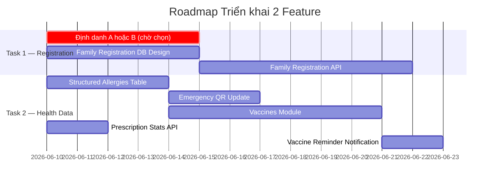

# Brainstorm & Phân tích Kỹ thuật — 2 Feature Mới
## Medical Diary API (v2.1 → v2.2)

> **Cơ sở phân tích:** Source code hiện tại tại `d:\Learning\TDTT\project\Medical_Diary\backend`

---

## 📋 Tổng quan Hiện trạng (Current State)

Trước khi vào từng task, đây là những điểm quan trọng từ source code hiện tại cần nắm:

| Thành phần | Hiện trạng |
|---|---|
| `profiles.phone_encrypted` | Lưu SĐT **mã hóa** bằng `pgcrypto` |
| `profiles.cccd_encrypted` | Chỉ có ở Doctor, **User thường KHÔNG có** CCCD |
| `profiles.allergies` | Text thuần (`"Penicillin, Aspirin"`), không có cấu trúc |
| `prescription_logs` | Có lịch sử uống thuốc theo đơn bác sĩ, không có bảng vaccine riêng |
| `RegisterRequest` | Yêu cầu: `email + phone + password + full_name + gender + dob` |
| Auth | Supabase Auth dùng **Email** làm định danh chính |
| Không có | Bảng `family_members`, `guardian`, `vaccines` |

---

## 🔴 TASK 1: Đăng ký bằng Phone Number + CCCD & Đăng ký Hộ gia đình cho Trẻ em

> [!IMPORTANT]
> **Quyết định đã xác nhận:** Task 1 gồm **2 phần bắt buộc**:
> - **Phần 1:** Chọn 1 trong 2 phương án định danh (A hoặc B) — *đang chờ xác nhận*
> - **Phần 2:** Đăng ký Hộ gia đình — Phương án C — **ĐÃ ĐƯỢC XÁC NHẬN**

### 1.1 Phân tích Gap (Khoảng trống) từ Source Code

**Vấn đề 1 — Phone-based login:**
- Supabase Auth hiện tại dùng `email` làm định danh → `sign_in_with_password` nhận `email` + `password`.
- Không có `sign_in_with_phone` trong `AuthService.login()`.
- `RegisterRequest` schema yêu cầu `email: EmailStr` (bắt buộc, Pydantic validate nghiêm).

**Vấn đề 2 — CCCD cho User thường:**
- Bảng `profiles` có `cccd_encrypted` nhưng bảng `Doctor` mới dùng field này.
- `RegisterRequest` (User thường) không có field `cccd`.
- Trong `service.register()` → INSERT vào profiles không truyền `cccd_encrypted`.

**Vấn đề 3 — Đăng ký trẻ em (chưa có CCCD/Email):**
- Không có khái niệm `guardian` (người giám hộ) trong schema hiện tại.
- Không có bảng `family_members` hay `child_profiles`.
- Supabase Auth **bắt buộc email** cho mọi user → trẻ em không có email thật.

---

### 1.2 Phương án A — Phone OTP làm phương thức đăng nhập thay thế

**Mô tả:** Tận dụng Supabase Auth Phone OTP (`sign_in_with_otp`) song song với Email.

```
User nhập SĐT → Nhận OTP → Xác thực → Đăng nhập
```

**Thay đổi cần làm:**

#### Backend — `auth/schemas.py`
```python
# Thêm schema mới
class RegisterWithPhoneRequest(BaseModel):
    phone_number: str = Field(..., pattern=r'^\+84[0-9]{9}$')  # chuẩn E.164
    password: str = Field(..., min_length=8)
    full_name: str = Field(..., min_length=2, max_length=100)
    gender: Literal['NAM', 'Nữ']
    date_of_birth: date
    cccd: Optional[str] = Field(None, min_length=12, max_length=12)

class PhoneLoginRequest(BaseModel):
    phone_number: str = Field(..., pattern=r'^\+84[0-9]{9}$')
    password: str = Field(..., min_length=8)
```

#### Backend — `auth/service.py`
```python
async def register_with_phone(self, data: RegisterWithPhoneRequest):
    # Supabase hỗ trợ phone signup:
    response = self.supabase.auth.sign_up({
        "phone": data.phone_number,
        "password": data.password
    })
    # → Supabase tự gửi OTP để verify phone

async def login_with_phone(self, data: PhoneLoginRequest):
    response = self.supabase.auth.sign_in_with_password({
        "phone": data.phone_number,
        "password": data.password
    })
```

**Ưu điểm:**
- Supabase hỗ trợ sẵn Phone Auth (cần bật Twilio/SMS provider trong Supabase Dashboard).
- Tái sử dụng toàn bộ flow JWT hiện tại.
- Người dùng có thể dùng SĐT **thay thế** Email (không cần thay đổi DB schema lớn).

**Nhược điểm:**
- Cần cấu hình SMS provider (Twilio/MessageBird) → Chi phí gửi OTP.
- Supabase Phone Auth yêu cầu số điện thoại theo chuẩn E.164 (`+84xxxxxxxxx`).
- Cần thêm 2 endpoints mới: `POST /auth/register-phone`, `POST /auth/login-phone`.

---

### 1.3 Phương án B — CCCD làm định danh chính (Identity Verification)

**Mô tả:** Cho phép đăng ký với CCCD thay vì Email. Hệ thống tạo email ảo nội bộ.

```
User nhập CCCD + SĐT → Hệ thống tạo email ảo → Tạo account Supabase
```

**Thay đổi Schema:**

#### `profiles` table — cần migration
```sql
-- Thêm cột cho user thường (hiện chỉ doctor có cccd_encrypted)
ALTER TABLE profiles ADD COLUMN IF NOT EXISTS id_type VARCHAR(20);
-- 'cccd' | 'passport' | 'birth_certificate' | 'none'
ALTER TABLE profiles ADD COLUMN IF NOT EXISTS id_verified_at TIMESTAMPTZ;
```

#### `auth/schemas.py`
```python
class RegisterWithCCCDRequest(BaseModel):
    cccd: str = Field(..., min_length=12, max_length=12)
    phone_number: str = Field(..., pattern=r'^\+?[0-9]{10,15}$')
    password: str = Field(..., min_length=8)
    full_name: str = Field(..., min_length=2, max_length=100)
    gender: Literal['NAM', 'Nữ']
    date_of_birth: date
```

#### `auth/service.py`
```python
async def register_with_cccd(self, data: RegisterWithCCCDRequest):
    # Tạo email ảo từ CCCD (chỉ dùng nội bộ để thỏa mãn Supabase Auth)
    virtual_email = f"cccd_{data.cccd}@medical-diary.internal"
    
    response = self.supabase.auth.sign_up({
        "email": virtual_email,
        "password": data.password
    })
    user_id = response.user.id
    
    # Lưu profile với cccd_encrypted
    await self.db.execute(text("""
        INSERT INTO profiles (id, full_name, role, gender, date_of_birth,
                             phone_encrypted, cccd_encrypted, id_type)
        VALUES (:id, :full_name, 'user', :gender, :dob,
                pgp_sym_encrypt(:phone, current_setting('app.encryption_key')),
                pgp_sym_encrypt(:cccd, current_setting('app.encryption_key')),
                'cccd')
    """), {...})
```

**Ưu điểm:** Không cần SMS provider. Bảo mật cao (CCCD mã hóa).

**Nhược điểm:** Email ảo nội bộ — người dùng không thể reset password qua email. Cần flow reset password riêng (qua SĐT OTP). Tiềm ẩn lỗi nếu user đăng ký CCCD đã tồn tại.

---

### 1.4 Phương án C — Đăng ký Hộ gia đình (Family Registration) cho Trẻ em ⭐

**Mô tả:** Bố/mẹ (Guardian) tạo tài khoản đại diện cho trẻ dưới 15 tuổi. Profile của trẻ được liên kết với tài khoản Guardian.

**Thiết kế Database mới:**

```sql
-- Bảng liên kết gia đình
CREATE TABLE family_members (
    id          UUID PRIMARY KEY DEFAULT gen_random_uuid(),
    guardian_id UUID NOT NULL REFERENCES profiles(id),  -- Bố/mẹ
    member_id   UUID NOT NULL REFERENCES profiles(id),  -- Trẻ em
    relationship VARCHAR(20) NOT NULL,                  -- 'father' | 'mother' | 'guardian'
    is_active   BOOLEAN DEFAULT true,
    created_at  TIMESTAMPTZ DEFAULT now(),
    deleted_at  TIMESTAMPTZ
);

-- Profile trẻ em (không có auth.users riêng)
-- Dùng profiles.id = gen_random_uuid() thay vì = auth.users.id
ALTER TABLE profiles ADD COLUMN is_dependent BOOLEAN DEFAULT false;
ALTER TABLE profiles ADD COLUMN guardian_id UUID REFERENCES profiles(id);
-- Trẻ em KHÔNG CÓ account Supabase Auth riêng
-- Được quản lý hoàn toàn bởi guardian
```

**Flow đăng ký:**
```
POST /auth/register-family-member
Body: {
    "full_name": "Nguyen Van Con",
    "date_of_birth": "2020-05-10",
    "gender": "NAM",
    "relationship": "father",
    "birth_certificate_number": "...",  // Optional, mã giấy khai sinh
}
→ Tạo profile mới với is_dependent=true, guardian_id = current_user.id
→ Tự động tạo bản ghi trong family_members
```

**Thay đổi cần làm trong source code:**

#### `users/models.py` — thêm model mới
```python
class FamilyMember(Base):
    __tablename__ = "family_members"
    id = Column(UUID(as_uuid=True), primary_key=True, server_default=text("gen_random_uuid()"))
    guardian_id = Column(UUID(as_uuid=True), ForeignKey("profiles.id"), nullable=False)
    member_id = Column(UUID(as_uuid=True), ForeignKey("profiles.id"), nullable=False)
    relationship = Column(
        String(20),
        CheckConstraint("relationship IN ('father', 'mother', 'guardian', 'other')"),
        nullable=False
    )
    is_active = Column(Boolean, default=True)
    created_at = Column(DateTime(timezone=True), server_default=text("now()"))
    deleted_at = Column(DateTime(timezone=True), nullable=True)
```

#### `profiles` table thêm cột:
```sql
ALTER TABLE profiles ADD COLUMN is_dependent BOOLEAN DEFAULT false;
ALTER TABLE profiles ADD COLUMN guardian_id UUID REFERENCES profiles(id);
ALTER TABLE profiles ADD COLUMN birth_cert_encrypted TEXT; -- Mã giấy khai sinh (tùy chọn)
```

#### API Endpoints mới:
```
POST   /auth/register-family-member     — Guardian tạo hồ sơ cho trẻ
GET    /users/me/family                 — Xem danh sách thành viên gia đình
GET    /users/family/{member_id}        — Xem hồ sơ thành viên
PATCH  /users/family/{member_id}        — Cập nhật hồ sơ thành viên
```

**Cơ chế bảo mật:**
- Guardian có quyền đọc/ghi toàn bộ dữ liệu của member được liên kết.
- RLS Policy: `guardian_id = auth.uid()` cho phép truy cập.
- Khi bác sĩ tìm kiếm bệnh nhân → có thể tìm cả dependent profiles.

**Ưu điểm:**
- Không cần tạo Supabase account cho trẻ.
- Tuân thủ thực tế Việt Nam (trẻ dưới 15 tuổi không có CCCD).
- Bố/mẹ quản lý tập trung hồ sơ gia đình.
- Mở rộng được cho người thân cao tuổi, người bệnh không tự quản lý được.

**Nhược điểm:**
- Cần thêm RLS Policies phức tạp hơn.
- Cần thay đổi nhiều endpoint để hỗ trợ context `guardian`.
- Cần migration DB (2 bảng mới + 2 cột mới).

---

### 1.5 So sánh & Trạng thái Quyết định Task 1

| Tiêu chí | Phương án A (Phone OTP) | Phương án B (CCCD) | Phương án C (Family) |
|---|---|---|---|
| Trạng thái | ⏳ **Chờ chọn** | ⏳ **Chờ chọn** | ✅ **Đã xác nhận** |
| Độ phức tạp | Trung bình | Trung bình | Cao |
| Chi phí vận hành | Cao (SMS Twilio) | Thấp | Thấp |
| Phù hợp Việt Nam | ✅ | ✅ | ✅✅ |
| Thay đổi DB | Ít | Trung bình | Nhiều |
| Thay đổi Code | Trung bình | Trung bình | Nhiều |

> [!IMPORTANT]
> **Cần xác nhận:** Chọn **1 trong 2** phương án định danh:
> - **Phương án A (Phone OTP):** Người dùng đăng nhập bằng SĐT + password. Supabase gửi OTP để xác minh. Yêu cầu cấu hình Twilio (có chi phí SMS).
> - **Phương án B (CCCD):** Người dùng đăng nhập bằng CCCD + SĐT + password. Hệ thống tạo email ảo nội bộ. Không cần SMS, nhưng cần flow reset password riêng.
>
> **Phương án C (Family Registration) đã được xác nhận** — sẽ triển khai song song với phương án A hoặc B.

---

## 🔵 TASK 2: Kiểm tra Dị ứng, Lịch sử Uống thuốc & Vaccine đã tiêm

### 2.1 Phân tích Gap từ Source Code

**Tình trạng hiện tại của Dị ứng (`allergies`):**
- Lưu trong `profiles.allergies` dạng **text thuần**: `"Penicillin, Aspirin"`.
- Không có cấu trúc (type, severity, reaction, diagnosed_date).
- Không có bảng riêng → không thể filter, search, hay cảnh báo tự động.
- Bác sĩ xem được qua consent scope `allergies`.

**Tình trạng hiện tại của Lịch sử Uống thuốc:**
- Có `prescription_logs` với `status` (`taken/skipped/untaken`) và `taken_at`.
- Phạm vi cần thiết: **chỉ theo dõi thuốc theo đơn bác sĩ** (`prescription_logs`) — OTC và thuốc tự mua **nằm ngoài phạm vi**.
- Có thể bổ sung thống kê adherence (tuân thủ uống thuốc) từ dữ liệu hiện có.

**Tình trạng Vaccine:**
- **Hoàn toàn không tồn tại** trong codebase hiện tại.
- Không có bảng `vaccines`, không có model, không có endpoint.
- Không có trong `consent_requests.requested_scope`.

---

### 2.2 Phương án A — Nâng cấp `allergies` thành cấu trúc JSONB

**Mô tả:** Giữ lưu trong `profiles.allergies` nhưng chuyển từ text sang JSONB có cấu trúc.

```sql
-- Migration: thay đổi kiểu dữ liệu
ALTER TABLE profiles ALTER COLUMN allergies TYPE JSONB USING allergies::jsonb;
```

**Cấu trúc JSONB:**
```json
[
  {
    "name": "Penicillin",
    "type": "medication",
    "severity": "severe",
    "reaction": "Sốc phản vệ",
    "diagnosed_date": "2020-01-15",
    "notes": "Không dùng bất kỳ kháng sinh nhóm Beta-lactam"
  },
  {
    "name": "Hải sản",
    "type": "food",
    "severity": "moderate",
    "reaction": "Nổi mề đay",
    "diagnosed_date": null
  }
]
```

**Thay đổi schema:**
```python
# users/schemas.py
class AllergyItem(BaseModel):
    name: str = Field(..., max_length=200)
    type: Literal['medication', 'food', 'environment', 'other']
    severity: Literal['mild', 'moderate', 'severe', 'unknown']
    reaction: Optional[str] = Field(None, max_length=500)
    diagnosed_date: Optional[date] = None
    notes: Optional[str] = Field(None, max_length=1000)

class UserProfileUpdateRequest(BaseModel):
    # ... existing fields ...
    allergies: Optional[List[AllergyItem]] = None  # Đổi từ str sang List
```

**Ưu điểm:** Không cần bảng mới, không phức tạp hóa schema, tích hợp vào profile hiện tại.

**Nhược điểm:** Migration data nguy hiểm (cần parse text cũ), mất lịch sử thay đổi dị ứng.

---

### 2.3 Phương án B — Bảng riêng `allergies` (Recommended) ⭐

**Mô tả:** Tạo bảng `allergies` độc lập với cấu trúc đầy đủ, hỗ trợ lịch sử.

```sql
CREATE TABLE allergies (
    id              UUID PRIMARY KEY DEFAULT gen_random_uuid(),
    user_id         UUID NOT NULL REFERENCES profiles(id),
    name            VARCHAR(200) NOT NULL,         -- Tên chất gây dị ứng
    allergy_type    VARCHAR(20) NOT NULL,           -- medication | food | environment | other
    severity        VARCHAR(20) NOT NULL DEFAULT 'unknown',  -- mild | moderate | severe | unknown
    reaction        TEXT,                           -- Phản ứng mô tả
    diagnosed_date  DATE,                           -- Ngày phát hiện
    diagnosed_by    UUID REFERENCES profiles(id),  -- Bác sĩ chẩn đoán (Optional)
    notes           TEXT,
    is_active       BOOLEAN DEFAULT true,           -- false = đã khỏi / không còn dị ứng
    created_at      TIMESTAMPTZ DEFAULT now(),
    updated_at      TIMESTAMPTZ DEFAULT now(),
    deleted_at      TIMESTAMPTZ                    -- Soft delete
);
```

**API Endpoints mới:**
```
POST   /allergies              — User thêm dị ứng mới
GET    /allergies              — User/Doctor xem danh sách dị ứng
PUT    /allergies/{id}         — User cập nhật thông tin dị ứng
DELETE /allergies/{id}         — Soft-delete (không xóa lịch sử)
GET    /allergies?patient_id=  — Doctor xem dị ứng của bệnh nhân (cần consent scope)
```

**Cập nhật `consent_requests.requested_scope`:**
```python
# Thêm scope mới vào validation
VALID_SCOPES = [
    # ... existing scopes ...
    'allergies',  # scope riêng cho bảng allergies
    'medications_history',
    'vaccines',
]
```

---

### 2.4 Lịch sử Uống thuốc — Phạm vi đã thu hẹp

> [!NOTE]
> **Đã xác định phạm vi:** Chỉ theo dõi thuốc theo đơn bác sĩ dựa trên `prescription_logs` hiện có. OTC, thuốc tự mua, thuốc bổ **không nằm trong phạm vi** của feature này.

**Không cần tạo bảng mới.** Tận dụng dữ liệu sẵn có từ `prescription_logs`:

**Bổ sung API thống kê adherence (từ dữ liệu hiện có):**
```
GET /prescription-logs/stats?prescription_id={id}
```
Response mẫu:
```json
{
  "prescription_id": "uuid",
  "medication_name": "Paracetamol 500mg",
  "total_doses": 15,
  "taken": 12,
  "skipped": 2,
  "untaken": 1,
  "adherence_rate": 80.0
}
```

**Bác sĩ xem lịch sử uống thuốc của bệnh nhân** (cần consent scope `prescriptions`):
```
GET /prescription-logs?prescription_id={id}&patient_id={id}
```

**Không cần migration DB** — chỉ thêm endpoint mới vào `prescriptions/router.py` và logic tính toán vào `prescriptions/service.py`.

---

### 2.5 Phương án — Vaccine Registry ⭐ (Tính năng mới hoàn toàn)

**Mô tả:** Bảng lưu lịch sử tiêm chủng, hỗ trợ cả vaccine cơ bản (sổ tiêm chủng trẻ em) và vaccine người lớn.

**Bảng `vaccines`:**
```sql
CREATE TABLE vaccines (
    id              UUID PRIMARY KEY DEFAULT gen_random_uuid(),
    user_id         UUID NOT NULL REFERENCES profiles(id),
    vaccine_name    VARCHAR(200) NOT NULL,              -- Tên vaccine
    vaccine_code    VARCHAR(50),                        -- Mã vaccine (WHO ICD-11)
    dose_number     INTEGER NOT NULL DEFAULT 1,         -- Mũi số mấy
    total_doses     INTEGER,                            -- Tổng số mũi cần tiêm
    administered_date DATE NOT NULL,                    -- Ngày tiêm
    next_due_date   DATE,                               -- Ngày tiêm nhắc lại
    administered_by VARCHAR(200),                       -- Nơi tiêm / Bác sĩ
    batch_number    VARCHAR(100),                       -- Số lô vaccine
    manufacturer    VARCHAR(200),                       -- Nhà sản xuất
    site            VARCHAR(50),                        -- Vị trí tiêm (left_arm, right_arm...)
    notes           TEXT,
    attachment_url  TEXT,                               -- Ảnh sổ tiêm / phiếu tiêm
    verified        BOOLEAN DEFAULT false,              -- Đã được xác minh bởi bác sĩ
    verified_by     UUID REFERENCES profiles(id),
    created_at      TIMESTAMPTZ DEFAULT now(),
    updated_at      TIMESTAMPTZ DEFAULT now(),
    deleted_at      TIMESTAMPTZ
);
```

**SQLAlchemy Model (mới hoàn toàn):**
```python
# Tạo module mới: app/modules/vaccines/models.py
class Vaccine(Base):
    __tablename__ = "vaccines"
    id = Column(UUID(as_uuid=True), primary_key=True, server_default=text("gen_random_uuid()"))
    user_id = Column(UUID(as_uuid=True), ForeignKey("profiles.id"), nullable=False)
    vaccine_name = Column(String(200), nullable=False)
    vaccine_code = Column(String(50), nullable=True)
    dose_number = Column(Integer, nullable=False, server_default=text("1"))
    total_doses = Column(Integer, nullable=True)
    administered_date = Column(Date, nullable=False)
    next_due_date = Column(Date, nullable=True)
    administered_by = Column(String(200), nullable=True)
    batch_number = Column(String(100), nullable=True)
    manufacturer = Column(String(200), nullable=True)
    notes = Column(Text, nullable=True)
    attachment_url = Column(Text, nullable=True)
    verified = Column(Boolean, default=False)
    verified_by = Column(UUID(as_uuid=True), ForeignKey("profiles.id"), nullable=True)
    created_at = Column(DateTime(timezone=True), server_default=text("now()"))
    updated_at = Column(DateTime(timezone=True), server_default=text("now()"))
    deleted_at = Column(DateTime(timezone=True), nullable=True)
```

**API Endpoints:**
```
POST   /vaccines                         — User thêm vaccine mới (từ sổ tiêm, ảnh scan)
GET    /vaccines                         — User xem lịch sử tiêm chủng
GET    /vaccines?patient_id=             — Doctor xem (cần consent scope: vaccines)
PATCH  /vaccines/{id}                   — Cập nhật thông tin
DELETE /vaccines/{id}                   — Soft-delete
GET    /vaccines/upcoming               — Xem lịch tiêm nhắc lại sắp tới
POST   /vaccines/{id}/verify            — Doctor xác minh hồ sơ tiêm chủng
```

**Tích hợp Notifications:**
- pg_cron có thể quét `vaccines.next_due_date` → gửi reminder qua `notifications`.
- Thêm `vaccine_reminder` vào notification types.

---

### 2.6 Tích hợp với Emergency QR (Public View)

Hiện tại, Emergency QR chỉ trả về `blood_type`, `allergies`, `emergency_contact`. Cần mở rộng:

```python
# emergency/service.py — cập nhật get_emergency_data()
# Nếu privacy_settings.show_allergies = true:
#   → JOIN với bảng allergies để trả về list structured allergies
#   → Hiển thị: severity, reaction (quan trọng cho cấp cứu!)
# Thêm vào privacy_settings:
#   "show_vaccines": false  (mặc định ẩn vaccine khỏi QR)
```

**Cập nhật `profiles.privacy_settings` default:**
```json
{
    "show_blood_type": true,
    "show_allergies": true,
    "show_emergency_contact": true,
    "show_vaccines": false,
    "show_current_medications": false
}
```

---

### 2.7 Cập nhật `consent_requests.requested_scope`

Cần mở rộng các scope hợp lệ trong `consent/models.py`:

```python
# Hiện tại:
VALID_SCOPES = [
    'blood_type', 'allergies', 'emergency_contact',
    'medical_records', 'prescriptions', 'diaries',
    'heart_rate', 'step_count', 'respiratory_rate'
]

# Sau khi thêm feature:
VALID_SCOPES = [
    'blood_type', 'allergies', 'emergency_contact',
    'medical_records', 'prescriptions', 'diaries',
    'heart_rate', 'step_count', 'respiratory_rate',
    'vaccines',           # Mới
    'medication_history', # Mới
    'allergies_detail',   # Mới (bảng allergies riêng, khác với text trong profiles)
]
```

---

### 2.8 Tổng hợp Thay đổi cần làm cho Task 2

| Thành phần | Hiện tại | Sau thay đổi | Loại thay đổi |
|---|---|---|---|
| `profiles.allergies` | `TEXT` | Giữ nguyên (backward compat) | Không đổi |
| Bảng `allergies` | Không có | Có (bảng riêng có cấu trúc) | **Mới** |
| Bảng `vaccines` | Không có | Có | **Mới** |
| Bảng `medication_history` | ~~Không có~~ | **Không làm** (ngoài phạm vi) | ~~Mới~~ |
| Module `vaccines/` | Không có | Có (models, schemas, service, router) | **Mới** |
| `prescription-logs/stats` API | Không có | Có (tính adherence rate) | Mở rộng |
| `consent_requests.requested_scope` | 9 scopes | +2 scopes: `vaccines`, `allergies_detail` | Mở rộng |
| `notifications.type` | 4 types | +1 (`vaccine_reminder`) | Mở rộng |
| `privacy_settings` JSONB default | 3 fields | +1 field: `show_vaccines` | Migration |
| Emergency QR response | `allergies` text | Structured allergies list | Nâng cấp |

---

## 🗺️ Roadmap Đề xuất



---

## ❓ Câu hỏi Cần làm rõ

> [!IMPORTANT]
> **Task 1 — Định danh (chọn A hoặc B):**
> 1. Muốn dùng **Phone OTP (A)** hay **CCCD (B)** làm phương thức định danh? Hai phương án khác nhau về chi phí và flow đăng nhập.

> [!IMPORTANT]
> **Task 1 — Family Registration (đã xác nhận làm, cần làm rõ):**
> 2. Tuổi giới hạn để đăng ký theo hộ gia đình là bao nhiêu? (< 15 tuổi theo luật CCCD VN, hay < 18?)
> 3. Có cần kiểm tra tuổi tự động (từ `date_of_birth`) hay Guardian tự khai báo?
> 4. Trẻ sau khi đủ 18 tuổi có thể "tách" ra và tự tạo account độc lập không?
> 5. Bác sĩ tìm kiếm bệnh nhân (qua `GET /doctors/search-patients`) có thể tìm thấy cả profile trẻ em (dependent) không?

> [!IMPORTANT]
> **Task 2 — Allergies:**
> 6. Allergies nhập bởi ai trước? User tự nhập hay chờ bác sĩ xác nhận?
> 7. Cần gợi ý tên thuốc/chất gây dị ứng từ danh sách chuẩn (ATC Code, ICD-10) hay user nhập tự do?

> [!IMPORTANT]
> **Task 2 — Vaccines:**
> 8. User tự nhập vaccine (từ sổ tiêm giấy) hay chỉ bác sĩ mới được thêm?
> 9. Có cần upload ảnh sổ tiêm (Supabase Storage) không?
