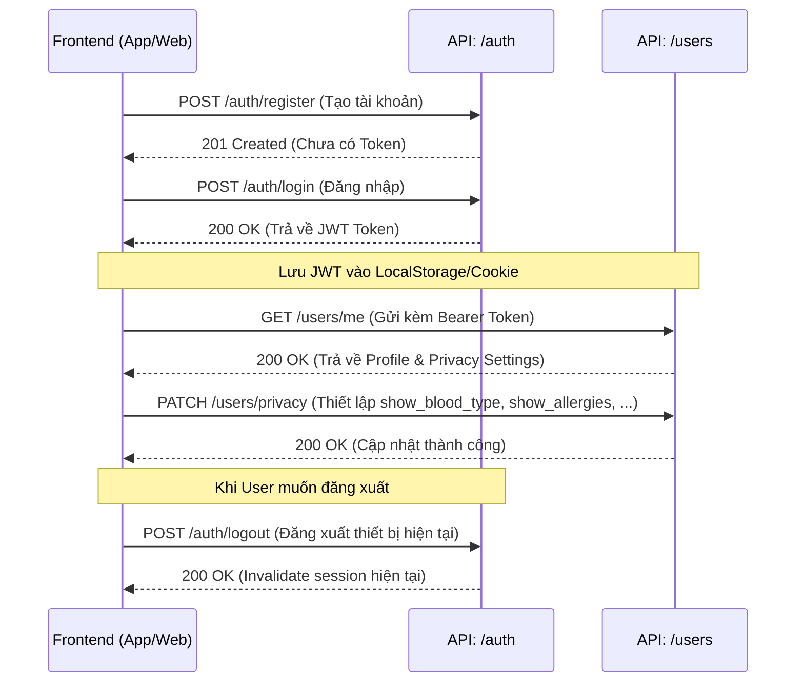
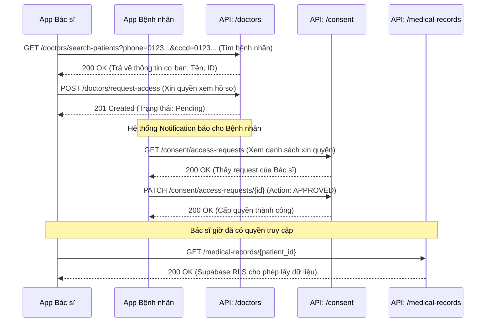
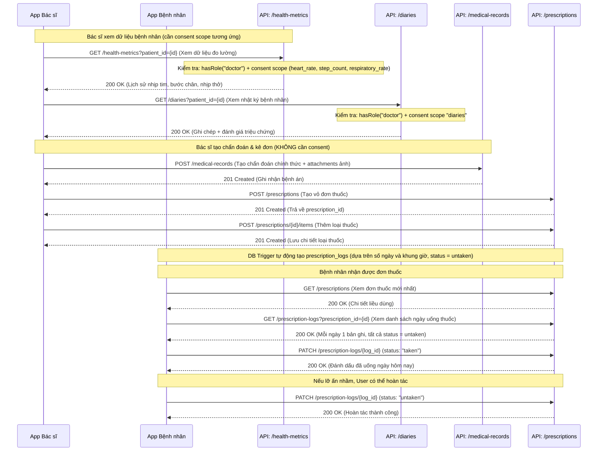
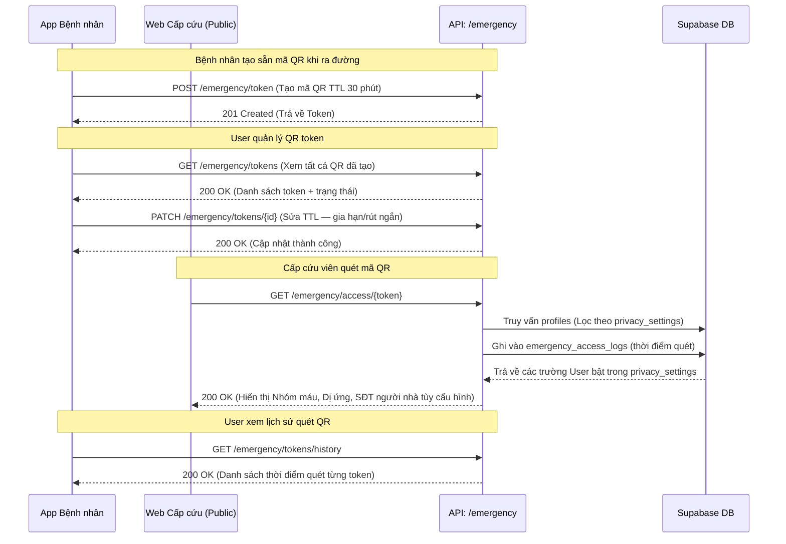
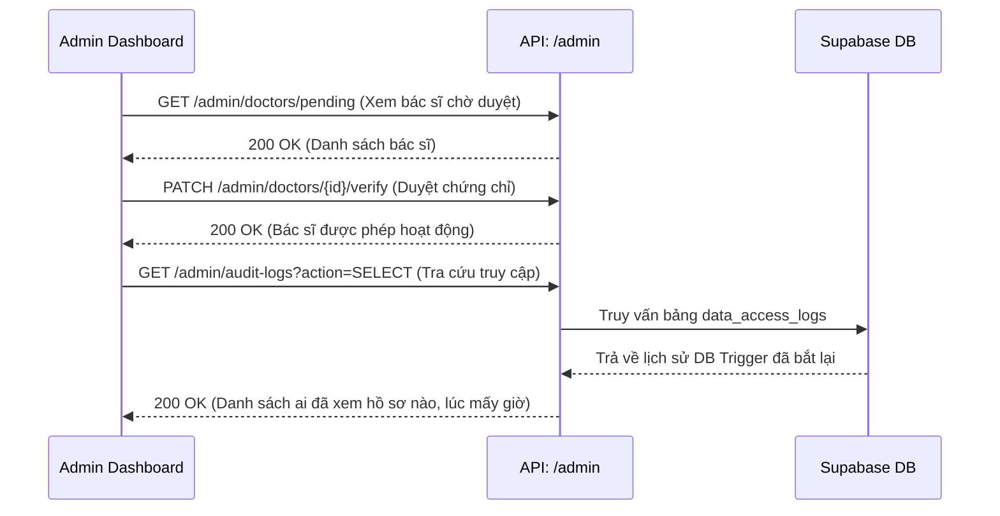

# Luồng tương tác API (API Integration Flows) - Medical Diary

Tài liệu này mô tả trình tự gọi các API (Sequence) cho các nghiệp vụ cốt lõi trong hệ thống. Nó giúp Frontend Developer và AI Agents hiểu rõ "kịch bản" giao tiếp giữa Client và Server.

---

## 1. Luồng Xác thực & Quản lý Quyền riêng tư (User Onboarding Flow)

Đây là luồng cơ bản nhất khi một bệnh nhân mới bắt đầu sử dụng ứng dụng: đăng ký, đăng nhập và thiết lập giới hạn bảo mật ngay từ đầu.

---

## 2. Luồng Ủy quyền Y tế (Doctor Consent Flow)

Đây là luồng phức tạp và quan trọng nhất của hệ thống, thể hiện quy trình Bác sĩ phải xin phép trước khi được đụng vào hồ sơ của Bệnh nhân.

---

## 3. Luồng Khám bệnh & Kê đơn (Medical Examination Flow)

Sau khi Bác sĩ đã được Bệnh nhân cấp quyền (từ Luồng 2), quy trình khám bệnh thực tế sẽ diễn ra như sau:

---

## 4. Luồng Truy cập Khẩn cấp (Emergency Access Flow)

Áp dụng khi Bệnh nhân gặp tai nạn, cấp cứu viên (không cần tài khoản) quét mã QR để lấy thông tin nhóm máu, dị ứng.

---

## 5. Luồng Quản trị viên (Admin Audit Flow)

Luồng dành cho Admin hệ thống để kiểm tra xem có Bác sĩ nào lạm dụng quyền hạn hay không.

