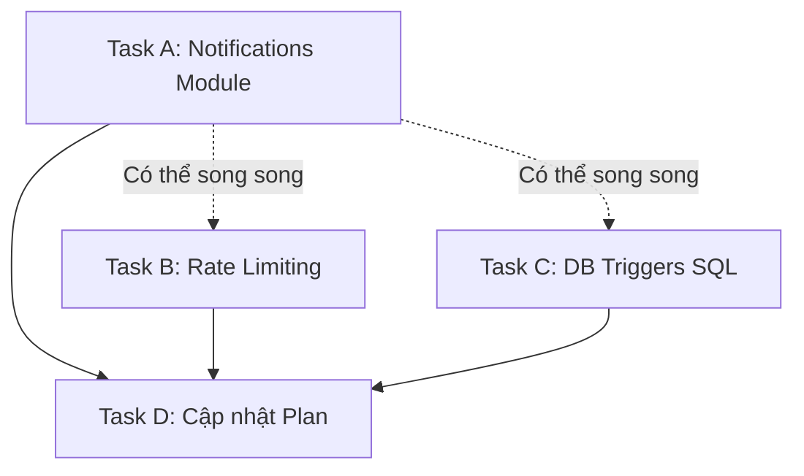

# Phân tích & Kế hoạch hoàn thành Backend — Medical Diary

## 1. Tổng quan trạng thái

Sau khi đối chiếu `implementation_plan.md` với **code thực tế** trong codebase, đây là trạng thái chính xác:

| Phase | Mô tả | Plan | Code thực tế | Trạng thái |
|---|---|---|---|---|
| **0** | Shared Utilities | ✅ | ✅ | ✅ Hoàn thành |
| **1** | Auth Module | ✅ | ✅ | ✅ Hoàn thành |
| **2** | Consent Helper | ✅ | ✅ | ✅ Hoàn thành |
| **3A** | Users Self-service | ✅ | ✅ | ✅ Hoàn thành |
| **3B** | Consent Module | ✅ | ✅ | ✅ Hoàn thành |
| **3C** | Medical Data Self-service | ✅ | ✅ | ✅ Hoàn thành |
| **4A** | Doctors Cross-user | ❌ (plan) | ✅ (code có) | ✅ **Hoàn thành** (plan chưa đánh dấu) |
| **4B** | Medical Data Cross-user | ✅ | ✅ | ✅ Hoàn thành |
| **5** | Emergency | ❌ (plan) | ✅ (code có) | ✅ **Hoàn thành** (plan chưa đánh dấu) |
| **6** | Notifications | ❌ | ❌ (3 file trống) | ❌ **CHƯA TRIỂN KHAI** |
| **7** | Admin | ❌ (plan) | ✅ (code có) | ✅ **Hoàn thành** (plan chưa đánh dấu) |
| **8** | Integration & Polish | ❌ | ⚠️ Một phần | ⚠️ **Còn thiếu** |

### Chi tiết Phase 8 (Integration):

| Mục | Trạng thái | Ghi chú |
|---|---|---|
| Đăng ký routers trong `main.py` | ✅ | 10 routers đã đăng ký (auth, consent, doctors, health_metrics, diaries, prescriptions, medical_records, users, admin, emergency) |
| `rate_limiter.py` (Limiter instance) | ⚠️ Một phần | File tồn tại với `Limiter` instance, nhưng **chưa gắn middleware vào `main.py`** và chưa áp dụng `@limiter.limit()` vào bất kỳ endpoint nào |
| `slowapi` trong `requirements.txt` | ✅ | Đã có |
| RLS Policies SQL | ⚠️ | Chỉ có 4 file SQL utilities (pgcrypto, session management), **chưa có RLS policies** |
| DB Triggers SQL | ❌ | Chưa có (audit log auto-generate, prescription_logs auto-generate) |

---

## 2. Các Task cần hoàn thành

### Task A: Triển khai Notifications Module 🔴 (Ưu tiên cao)

> [!IMPORTANT]
> Đây là module duy nhất **hoàn toàn trống** trong toàn bộ backend. Model đã có sẵn.

**Phạm vi:** 3 file cần triển khai

#### A.1 — `app/modules/notifications/schemas.py`

```python
from datetime import datetime
from typing import Optional
from uuid import UUID

from pydantic import BaseModel


class NotificationResponse(BaseModel):
    id: UUID
    type: str        # 'access_request' | 'prescription_new' | 'prescription_reminder' | 'emergency_token_expired'
    title: str
    message: str
    reference_id: Optional[UUID] = None
    is_read: bool
    created_at: datetime

    model_config = {
        "json_schema_extra": {
            "example": {
                "id": "3fa85f64-5717-4562-b3fc-2c963f66afa6",
                "type": "access_request",
                "title": "Yêu cầu truy cập mới",
                "message": "Bác sĩ Nguyễn Văn A yêu cầu quyền truy cập hồ sơ của bạn.",
                "reference_id": "3fa85f64-5717-4562-b3fc-2c963f66afa6",
                "is_read": False,
                "created_at": "2026-05-28T08:00:00Z"
            }
        }
    }
```

#### A.2 — `app/modules/notifications/service.py`

```python
class NotificationsService:
    def __init__(self, db: AsyncSession):
        self.db = db

    async def list_notifications(self, user_id: UUID) -> list[NotificationResponse]:
        """Lấy danh sách thông báo của user, sắp xếp mới nhất trước."""
        # SELECT * FROM notifications WHERE user_id = :user_id ORDER BY created_at DESC

    async def mark_as_read(self, user_id: UUID, notification_id: UUID) -> MessageResponse:
        """Đánh dấu thông báo đã đọc. Raise 404 nếu không tìm thấy hoặc không thuộc về user."""
        # UPDATE notifications SET is_read = true WHERE id = :id AND user_id = :user_id
```

**Các quy tắc:**
- Chỉ dùng `flush()`, không `commit()` (quy tắc #8)
- Ưu tiên SQLAlchemy ORM (quy tắc #9)
- Dùng `Notification` model từ `app.modules.notifications.models`
- Import `logger = logging.getLogger("medical_diary")`
- OOP Service (quy tắc #7)

#### A.3 — `app/modules/notifications/router.py`

| Endpoint | Method | Auth | Mô tả |
|---|---|---|---|
| `/notifications` | GET | Bắt buộc (any role) | Danh sách thông báo |
| `/notifications/{id}/read` | PATCH | Bắt buộc (any role) | Đánh dấu đã đọc |

**Lưu ý:** Router đã được import và đăng ký trong `main.py` — **NHƯNG hiện tại file trống** nên sẽ lỗi import. Cần kiểm tra xem `main.py` đã import `notifications` router chưa.

> [!WARNING]
> Kiểm tra `main.py` — hiện tại **CHƯA** import notifications router. Cần thêm:
> ```python
> from app.modules.notifications.router import router as notifications_router
> app.include_router(notifications_router)
> ```

---

### Task B: Tích hợp Rate Limiting 🟡 (Ưu tiên trung bình)

> File `app/core/rate_limiter.py` đã tồn tại với `Limiter` instance nhưng chưa được tích hợp vào ứng dụng.

#### B.1 — Cập nhật `app/main.py`

Thêm middleware và error handler cho SlowAPI:

```python
# Import thêm
from slowapi import _rate_limit_exceeded_handler
from slowapi.errors import RateLimitExceeded
from slowapi.middleware import SlowAPIMiddleware
from app.core.rate_limiter import limiter

# Gắn limiter state
app.state.limiter = limiter

# Thêm middleware (sau CORS, trước RLS)
app.add_middleware(SlowAPIMiddleware)

# Thêm error handler
app.add_exception_handler(RateLimitExceeded, _rate_limit_exceeded_handler)
```

#### B.2 — Gắn `@limiter.limit()` vào các endpoint nhạy cảm

| Endpoint | Giới hạn | File |
|---|---|---|
| `POST /auth/login` | `5/minute` | `auth/router.py` |
| `POST /auth/register` | `3/minute` | `auth/router.py` |
| `POST /auth/register-doctor` | `3/minute` | `auth/router.py` |
| `POST /doctors/request-access` | `10/day` | `doctors/router.py` |
| `GET /emergency/access/{token}` | `30/minute` | `emergency/router.py` |

Mỗi endpoint cần thêm `Request` dependency và decorator:

```python
from starlette.requests import Request
from app.core.rate_limiter import limiter

@router.post("/login", ...)
@limiter.limit("5/minute")
async def login(request: Request, ...):
    ...
```

---

### Task C: DB Triggers SQL 🟡 (Ưu tiên trung bình)

> Tạo SQL triggers cho audit logging tự động và prescription_logs auto-generation.

#### C.1 — Audit Log Trigger

Tạo file `supabase/policies/005_audit_log_trigger.sql`:
- Trigger function ghi vào `data_access_logs` khi bác sĩ INSERT/UPDATE/DELETE trên `medical_records`, `prescriptions`, `diaries`, `health_metrics`
- Lấy `actor_id` từ `current_setting('request.jwt.claims')::json->>'sub'`

#### C.2 — Prescription Logs Auto-Generation Trigger

Tạo file `supabase/policies/006_prescription_logs_trigger.sql`:
- Khi INSERT vào `prescription_items`, tự động tạo các bản ghi `prescription_logs` tương ứng (1 bản ghi cho mỗi ngày × mỗi giờ uống trong `scheduled_times` × `duration_days`)

> [!NOTE]
> Cả hai trigger này cần được chạy thủ công trên Supabase SQL Editor hoặc tạo Alembic migration. Nên chọn phương án migration để có version control.

---

### Task D: Cập nhật `implementation_plan.md` 🟢 (Ưu tiên thấp)

Đánh dấu ✅ cho tất cả các mục đã hoàn thành nhưng plan vẫn đánh `[ ]`:
- Phase 4A (Doctors): Tất cả schemas, service, router
- Phase 5 (Emergency): Tất cả schemas, service, router
- Phase 7 (Admin): Tất cả schemas, service, router

---

## 3. Thứ tự thực hiện khuyến nghị



| Thứ tự | Task | Thời gian ước tính | Lý do ưu tiên |
|---|---|---|---|
| 1️⃣ | **Task A: Notifications** | ~15 phút | Module trống gây lỗi import tiềm ẩn, là tính năng cốt lõi |
| 2️⃣ | **Task B: Rate Limiting** | ~10 phút | Bảo mật cơ bản, code đã sẵn sàng chỉ cần gắn |
| 3️⃣ | **Task C: DB Triggers** | ~20 phút | Tự động hóa, không chặn tính năng nào |
| 4️⃣ | **Task D: Cập nhật Plan** | ~5 phút | Housekeeping |

---

## 4. Tóm tắt

> [!TIP]
> **Backend đã hoàn thành ~90%.** Chỉ còn 3 task chính:
> 1. 🔴 **Notifications** — Module duy nhất chưa có code
> 2. 🟡 **Rate Limiting** — Đã có `Limiter` instance, chỉ cần gắn vào app
> 3. 🟡 **DB Triggers** — Tự động hóa audit log và prescription logs
>
> Tổng thời gian ước tính: **~50 phút** để hoàn thành 100% backend.
