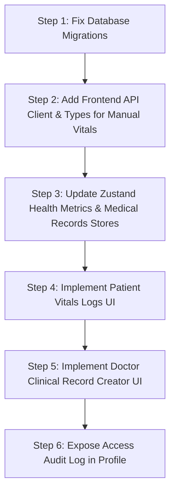

# Full-Stack Feature Parity Audit & Implementation Roadmap

## 1. Database Migration Audit

This audit evaluates the SQLAlchemy models and migration history files under `backend/alembic/versions/` against the standards defined in `.claude/system/migration-safe.md`.

### Summary of Discovered Schema & Migration Issues

| Revision ID / File | Description | Mapped SQL / Actions | Safety & Rollback Audit Findings |
|---|---|---|---|
| `dee690ba0a46_initial_schema.py` | Initial database tables and relationships | Standard initial migration. | **Safe.** Correct table structures, types, and standard initial tables. |
| `26c90af1fec5_remove_phone_encrypted_from_profiles.py` | Supposed to remove `phone_encrypted` from profiles | `upgrade()` adds `gender` and `date_of_birth` columns.<br>`downgrade()` drops them. | **Critical Issue.** Mismatch between revision name and code. It does NOT drop `phone_encrypted` but only adds `gender` and `date_of_birth`. This leaves `phone_encrypted` in the DB. |
| `432955958e19_init_supabase_functions.py` | Runs `001_pgcrypto_setup.sql` setup | `upgrade()` runs external SQL.<br>`downgrade()` is empty (`pass`). | **Critical Issue.** Violates the rule that `downgrade()` must reverse all changes. If run in production, rollback is impossible without manual SQL intervention. |
| `07954f8fa416_add_phone_encrypted_back_to_profiles.py` | Supposed to add `phone_encrypted` back | `upgrade()` calls `op.add_column` for `phone_encrypted`. | **Critical Issue.** Since `26c90af1fec5` never dropped `phone_encrypted`, running this migration on a fresh database will crash with: `column "phone_encrypted" of relation "profiles" already exists`. |
| `0aac322b299d_add_expires_at_to_consent_permissions.py` | Add `expires_at` column | `upgrade()` drops `expires_at`. | **Issue.** Reverse logic error: it drops the column in `upgrade` and drops it in `downgrade` as well. Irreversible. |
| `fc3e72c98108_add_email_to_doctors.py` | Add `email` column | `upgrade()` drops `email`. | **Issue.** Reverse logic error: both upgrade and downgrade drop the `email` column. |
| `3dc3eaa482ad_update_gender_constraint.py` | Reconcile gender strings | Drop constraint, update records to 'NAM'/'Nữ', recreate constraint. | **Issue.** Upgrade and downgrade blocks are identical, meaning rolling back this migration does not restore the previous string formats ('male', 'female'). |
| `95fddc3b7d94_add_audit_and_prescription_triggers.py` | Setup log triggers | Setup SQL functions and triggers. | **Issue.** Upgrade and downgrade blocks are identical, meaning downgrade repeats the drop commands rather than restoring the old triggers. |
| `0351ddbdf002_make_prescription_items_optional_and_.py` | Relax constraints on prescription items | `upgrade()` makes columns nullable.<br>`downgrade()` alters them back to `NOT NULL`. | **High Risk.** If `NULL` values are inserted while the migration is active, running a downgrade in production will crash because of the `NOT NULL` constraint violation. |
| `b26d8d7ce31e_add_manual_health_records_table.py` | Add table for manual vitals | `upgrade()` drops index and drops table. | **Critical Issue.** Reversal error: both upgrade and downgrade drop the table, meaning the migration destroys data on upgrade. |
| `971dcd67e1ac_add_blood_type_check_constraint.py` | Add constraint on blood type | Re-adds check constraints. | **Issue.** Upgrade and downgrade are identical. Downgrade also makes column NOT NULL, raising production error risks. |
| `6e27fa13159f_add_custom_privacy_fields_to_emergency_.py` | Add privacy flags to tokens | Drops the columns instead of adding them. | **Issue.** Upgrade and downgrade are identical; columns are dropped in both. |
| `f4c9a2d1b8e7_reconcile_emergency_token_privacy_flags.py` | Align token flags | Run data updates. | **Issue.** Empty downgrade block (`pass`), making it irreversible. |

---

## 2. Backend vs. Frontend API & Model Audit

This section details the gaps between the backend FastAPI router definitions and the frontend service/store layers.

### Gap Analysis: API Endpoints & State Management

#### A. Missing API Wrappers
The following endpoints are fully functional in the backend but are missing in the frontend's API client wrappers (`frontend/src/api/**/*.ts`):
1. **Health Metrics Module**:
   - `POST /health-metrics/manual` (Registers manual vitals such as blood pressure, glucose, SpO2, weight, body temperature)
   - `GET /health-metrics/manual` (Lists historical manual vitals for a patient/doctor)
2. **Prescriptions Module**:
   - `POST /prescriptions/internal/send-reminders` (Internal medication scheduler/reminder dispatcher)

#### B. Missing TypeScript Interfaces
The frontend does not have types defined for the manual vitals structures (`frontend/src/api/health_metrics/types.ts`):
```typescript
export type MetricType = 'blood_pressure' | 'blood_glucose' | 'spo2' | 'body_temperature' | 'weight';

export interface BloodPressureMetrics {
  systolic: number;
  diastolic: number;
  pulse?: number | null;
}

export interface BloodGlucoseMetrics {
  value: number;
  meal_context: 'fasting' | 'after_meal' | 'random';
}

export interface SpO2Metrics {
  value: number;
}

export interface BodyTemperatureMetrics {
  value: number;
}

export interface WeightMetrics {
  value: number;
  height?: number | null;
}

export interface ManualHealthRecordCreateRequest {
  metric_type: MetricType;
  metrics: Record<string, any>;
  device_name?: string | null;
  notes?: string | null;
  recorded_at: string;
}

export interface ManualHealthRecordResponse {
  id: string;
  user_id: string;
  metric_type: MetricType;
  metrics: Record<string, any>;
  device_name?: string | null;
  notes?: string | null;
  recorded_at: string;
  created_at: string;
}
```

#### C. Missing Zustand Stores & State Management
- `useHealthMetricsStore` has no state fields (e.g., `manualItems`) or async actions (`loadManualMetrics`, `createManualMetric`) to handle manual records.

#### D. Missing DTO Mappings
- `healthMetricsMapper.ts` is missing conversion functions for manual health records (`mapManualHealthRecordDto`, `mapManualRecordFormToDto`).

#### E. Missing React Query / Mutation Hooks
- **N/A**: The frontend utilizes Zustand stores exclusively to manage asynchronous side effects and load states. No react-query hooks are used.

#### F. Contract Inconsistencies
- **Gender Format**: The backend expects `'male' | 'female'` during registration/updates but stores `'NAM' | 'Nữ'` in the database via migration triggers. The frontend profile settings must handle this mapping.
- **Export Scope**: The frontend has a general `scope` parameter in `exportData(format, scope)`. However, the backend currently only supports `scope="profile"` and rejects other scopes with a `400 Bad Request`.

---

## 3. Frontend UI vs. Backend Features Gap Analysis & Roadmap

### Features Implemented in the Backend but Missing in the UI

1. **Manual Health Vitals Logging & Review**:
   - The backend allows tracking of blood pressure, blood glucose, SpO2, body temperature, and weight.
   - The frontend `HealthMetricsPage.tsx` currently only supports automated wearable vitals (heart rate, step count, respiratory rate) and completely lacks inputs/views for manual data.
2. **Clinical Records Creation by Doctors**:
   - The backend includes a `POST /medical-records` endpoint to let verified doctors create a diagnosis and attach documents.
   - The frontend `DoctorPatientDetail.tsx` page has a "Hồ sơ bệnh án" table but lacks any form, dialog, or button to let doctors *create* new clinical records.
3. **Audit Access Logs**:
   - The patient `ProfilePage` doesn't expose this history log, even though the store (`loadAccessHistory`) and API are fully implemented.

### Missing UI Views, Forms, and Components
- **Manual Vitals Modal/Form**: Form with conditional inputs based on selected metric type (e.g., systolic/diastolic for blood pressure, meal context for glucose).
- **Manual Vitals History Table**: Component to display and filter manual records.
- **Doctor Diagnostic Record Form**: Modal/Form on the doctor portal to write diagnosis notes and upload certificate attachments.

---

## 4. Implementation Roadmap & Priorities



### Phase 1: Database Integrity (High Priority)
1. **Fix Alembic Migrations**:
   - Correct the revision script `26c90af1fec5` to drop `phone_encrypted` in its `upgrade()`.
   - Re-arrange and verify that `07954f8fa416` doesn't fail on duplicate column declaration.
   - Provide proper SQL commands in `downgrade()` functions for `432955958e19` (Supabase policies setup) and `f4c9a2d1b8e7` to make migrations reversible.

### Phase 2: API & Store Wiring (Medium Priority)
1. **Add Manual Vitals Endpoints**:
   - Wrap `POST/GET /health-metrics/manual` in `healthMetricsApi.ts`.
   - Add TypeScript schemas and mapping routines in `healthMetricsMapper.ts`.
2. **Expand Zustand Stores**:
   - Add `manualItems` state, `loadManualMetrics()`, and `createManualMetric()` actions in `useHealthMetricsStore`.
   - Add `createRecord()` action in `useMedicalRecordStore` mapping to `POST /medical-records`.

### Phase 3: Frontend UI Parity (Medium Priority)
1. **Manual Health Vitals UI**:
   - Add a "Ghi chỉ số nhập tay" section in `HealthMetricsPage.tsx` with fields for blood pressure, glucose, SpO2, weight, and temperature.
   - Update charts/tables to display manual history.
2. **Doctor Clinical Record Creator**:
   - Add a "Thêm bệnh án mới" button and dialog in `DoctorPatientDetail.tsx` allowing verified doctors to log diagnoses.
3. **Patient Audit Log Widget**:
   - Embed the `accessHistory` table on the patient `ProfilePage.tsx` so users can see exactly when and who accessed their medical data.
