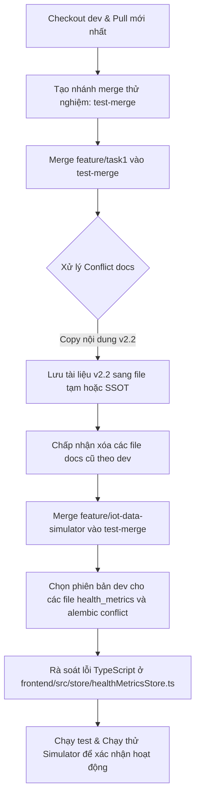

# Báo Cáo Phân Tích Xung Đột (Merge Conflicts) & Nguy Cơ Mất Code khi Merge `dev`

Tài liệu này phân tích chi tiết các file bị xung đột, các phần code có nguy cơ bị tự động ghi đè hoặc xóa (modify/delete conflicts), và đề xuất giải pháp xử lý an toàn khi merge nhánh `dev` với `feature/task1` và `feature/iot-data-simulator`.

---

## 1. Tóm tắt nhanh (Quick Summary)

| Nhánh so với `dev` | File có Conflict thực tế | Nguy cơ mất code/docs do tự động xóa (Modify/Delete) | Lỗi logic tiềm ẩn sau auto-merge |
| :--- | :--- | :--- | :--- |
| **`feature/task1`** | `main.py`<br>`admin/schemas.py` | **Rất cao**: `backend/docs/API.md`, `DB_SCHEMAS.md`, `SCHEMAS.md` bị xóa trên `dev` nhưng chứa thiết kế tính năng mới trên `task1`. | Lệch kiểu dữ liệu trả về của `AuthService.login` (`LoginResult` vs `LoginResponse`). |
| **`feature/iot-data-simulator`** | `b26d8d7c_add_manual_health_records_table.py`<br>`consent/schemas.py`<br>`health_metrics/(models, router, schemas, service).py` | Thấp (các file simulator nằm trong folder `mock_data` mới sẽ tự động được thêm). | **Trung bình**: `healthMetricsApi.list` đổi signature trên `dev` nhưng store của simulator gọi theo kiểu cũ sẽ lỗi runtime. |

---

## 2. Chi tiết Nhánh `feature/task1`

Nhánh này phân tách từ `dev` tại commit `ad3588c` (từ ngày 20/05/2026). Do `dev` đã đi rất xa và tái cấu trúc tài liệu, có các xung đột lớn sau:

### A. Xung đột nội dung (Content Conflicts)

1. **`backend/app/main.py`**
   * **Nguyên nhân**: Cả hai nhánh đều tự thêm phần import và `include_router(admin_router)`.
   * **Giải quyết**: Chọn giữ phiên bản của `dev` vì `dev` đã có thêm các router khác (`emergency_router`, `notifications_router`) được cấu hình chuẩn.

2. **`backend/app/modules/admin/schemas.py`**
   * **Nguyên nhân**: Nhánh `dev` đã tối ưu và thêm cấu hình `model_config` (json schema ví dụ tiếng Việt) cho `DoctorVerifyRequest` mà `task1` không có.
   * **Giải quyết**: Giữ phiên bản của `dev`.

### B. Nguy cơ mất tài liệu nghiêm trọng (Modify/Delete Conflicts)
* **Các file bị ảnh hưởng**: 
  * `backend/docs/API.md`
  * `backend/docs/DB_SCHEMAS.md`
  * `backend/docs/SCHEMAS.md`
* **Mô tả lỗi**: Nhánh `dev` đã xóa các file này trong thư mục `backend/docs/` (chuyển vào `.claude/` rồi xóa các phiên bản cũ). Tuy nhiên, trên nhánh `feature/task1`, các file này đã được cập nhật thông tin thiết kế cho các tính năng v2.2 sắp tới bao gồm:
  * **Family Registration** (`/auth/register-family-member`)
  * **Allergies Management** (`/allergies`)
  * **Vaccine History** (`/vaccines`)
  * **Prescription stats / Adherence rate** (`/prescription-logs/stats`)
* **Hậu quả nếu bấm merge mặc định**: Nếu chọn giải quyết conflict bằng cách ưu tiên xóa file (theo `dev`), **toàn bộ tài liệu thiết kế của các tính năng v2.2 này sẽ biến mất**.
* **Khắc phục**: Trước khi hoàn tất merge, cần sao chép các phần viết thêm về Vaccine, Family, Allergies từ `task1` đưa vào các file tài liệu tương ứng hiện tại của `dev` (như `.claude/tasks/vaccination.md` hoặc `SYSTEM_DESIGN_SSOT.md`).

### C. Lệch logic sau merge (Auto-merge Risks)
* **`backend/app/modules/auth/service.py`**:
  * Git sẽ tự động merge vì không phát hiện conflict dòng trùng nhau.
  * Tuy nhiên, trên `dev`, hàm `login` đã được đổi kiểu trả về thành `LoginResult` (chứa cả `access_token` và `refresh_token`), trong khi `task1` vẫn giữ kiểu cũ `LoginResponse`.
  * **Cần kiểm tra**: Đảm bảo các hàm gọi AuthService trên nhánh `task1` (nếu có) được cập nhật để hứng `LoginResult` thay vì `LoginResponse`.

---

## 3. Chi tiết Nhánh `feature/iot-data-simulator`

Nhánh này chứa code giả lập phần cứng thiết bị đeo (IoT simulator) và các chỉnh sửa của tính năng nhập chỉ số sức khỏe thủ công (manual health records).

### A. Xung đột nội dung (Content Conflicts)

1. **`backend/alembic/versions/b26d8d7ce31e_add_manual_health_records_table.py` (Add/Add Conflict)**
   * **Nguyên nhân**: Cả hai nhánh đều tạo file migration với cùng ID `b26d8d7ce31e`.
   * **Nội dung khác nhau**: Phiên bản trên `dev` có cấu trúc chuẩn hơn kèm CheckConstraint giới hạn giá trị của `metric_type` (`blood_pressure`, `blood_glucose`, `spo2', 'body_temperature', 'weight`). Phiên bản trên simulator sử dụng comment tiếng Việt và thiếu constraint này.
   * **Giải quyết**: Sử dụng file migration của nhánh `dev` làm chuẩn.

2. **`backend/app/modules/health_metrics/` (models.py, router.py, schemas.py, service.py)**
   * **Nguyên nhân**: Cả hai nhánh đều cài đặt các API và logic cho `/health-metrics/manual`.
   * **Khác biệt**:
     * `dev` sử dụng comment tiếng Anh, viết chuẩn Pydantic v2 type hints (`dict[str, object]`), và validate dữ liệu thông qua mapping động.
     * `simulator` sử dụng tiếng Việt có dấu, định nghĩa type lỏng lẻo (`dict`) và các hàm service có chút khác biệt về mặt cấu trúc ghi log.
   * **Giải quyết**: Chọn giữ code backend của `dev` vì nó đã được tối ưu hóa theo tiêu chuẩn dự án (ASCII comments, type-safe).

3. **`backend/app/modules/consent/schemas.py`**
   * **Nguyên nhân**: Nhánh `dev` dùng `VALID_CONSENT_SCOPES = set(get_args(ConsentScope))` để validate động. Nhánh `simulator` lại add cứng giá trị vào set tĩnh.
   * **Giải quyết**: Giữ code của `dev`.

### B. Lỗi tích hợp giao diện (Silent Compilation/Runtime Errors)
* **API Client & Store**:
  * Trên nhánh `dev`, api client `healthMetricsApi.list` đã được refactor để nhận 1 tham số duy nhất là object `HealthMetricListParams` (để lọc theo khoảng thời gian và patient_id).
  * Trên nhánh `simulator`, file api và store vẫn gọi theo cách cũ truyền 3 đối số rời rạc: `list(start, end, patientId)`.
  * **Hậu quả**: Khi merge, Git sẽ tự động áp dụng file của `dev` (vì nhánh simulator không sửa file này kể từ merge base). Giao diện/Store trên nhánh simulator sau khi merge sẽ bị **lỗi crash hoặc lỗi biên dịch TypeScript** do truyền sai tham số vào `healthMetricsApi.list()`.
  * **Giải quyết**: Sau khi merge, cần rà soát lại `frontend/src/store/healthMetricsStore.ts` và sửa các lệnh gọi `healthMetricsApi.list(...)` để truyền dạng object: `healthMetricsApi.list({ start, end, patientId })`.

---

## 4. Quy trình Merge An Toàn Đề Xuất

Để đảm bảo không bị mất code hoặc hỏng dữ liệu, hãy thực hiện merge tuần tự theo các bước sau:



### Hướng dẫn lệnh cụ thể cho User tự chạy:

```bash
# 1. Tạo nhánh test từ dev
git checkout dev
git pull origin dev
git checkout -b test-merge-resolve

# 2. Merge task1 trước
git merge origin/feature/task1

# --> Tại bước này, git báo modify/delete cho API.md, DB_SCHEMAS.md, SCHEMAS.md.
# Dùng lệnh sau để lưu lại nội dung chỉnh sửa của task1 trước khi quyết định xóa:
git show origin/feature/task1:backend/docs/API.md > temp_api_v2.2.md

# Chấp nhận xóa các file đó trên nhánh test:
git rm backend/docs/API.md backend/docs/DB_SCHEMAS.md backend/docs/SCHEMAS.md
# Resolve các conflict ở main.py và admin/schemas.py bằng cách chọn HEAD (dev)
git commit -m "Resolve merge with feature/task1"

# 3. Merge simulator tiếp theo
git merge origin/feature/iot-data-simulator

# --> Git báo conflict ở health_metrics và migration b26d8d7c
# Ưu tiên chọn code của dev (HEAD) cho các file backend:
git checkout --ours backend/app/modules/health_metrics/
git checkout --ours backend/app/modules/consent/schemas.py
git checkout --ours backend/alembic/versions/b26d8d7ce31e_add_manual_health_records_table.py

# Add file simulator mới (không bị conflict):
git add backend/mock_data/

# Commit giải quyết xong conflict
git commit -m "Resolve merge with feature/iot-data-simulator"
```

---
trigger: always_on
---
